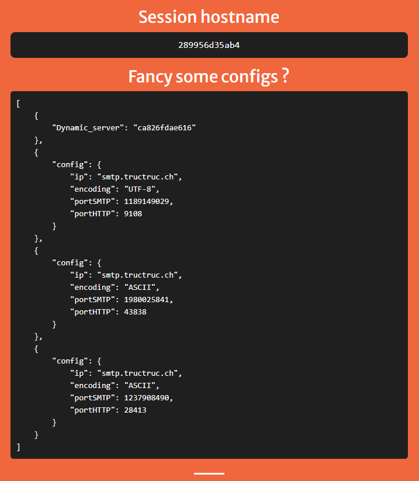

# Step 5

## Launch servers

First of all, we needed to build the recipe, by doing:

```docker
docker-compose up
# OR
docker-compose up --build
```

The first cmd will print warning that the image has not been built already.

Then, it will run the container by default. It is possible to run
the container in background, with:

```docker
docker-compose start
```

The container can be killed with:

```docker
docker-compose stop
# OR
docker-compose kill 
```

## Accessing page

With a browser, it is now possible to access the static page by typing [localhost](http://localhost) in the nav. bar.

## Round-robin and sticky sessions

**Round-robin** is a way to dispatch the request amongst all the servers. Each server is called one after the other without
ever-changing their order. It is as if the servers are placed in a circular buffer. If there is 3 server, they will be 
called in the following order: 1-2-3-1-2-3-1-2-3-1-...

**Sticky session** are used by the load balancer to connect the client to a specific server. This is necessary for an 
applications that stores information on a specific server only and thus, need to connect each time on the same server.

## Modifications

### Docker compose

To demonstrate the effects of a sticky session and the round-robin fashion, we changed the quantity of replicas of each 
server, static and dynamic, to 3. To do so we added the field below:

```yaml
        deploy:
            replicas: 3
```

We modified the static server service by enabling traefik sticky sessions. This can be done by adding the following two 
labels:

```yaml
        labels:
            
            # ...
            
            # sticky session
            - traefik.http.services.static.loadbalancer.sticky.cookie=true
            - traefik.http.services.static.loadbalancer.sticky.cookie.name=static-cookie
```

We also added the [whoami](https://doc.traefik.io/traefik/getting-started/quick-start/) service in order to validate the
effects of the sticky sessions.

```yaml
    whoami:
        # A container that exposes an API to show its IP address
        image: traefik/whoami
        deploy:
            replicas: 3
        labels:
            - traefik.autodetect=true
            - traefik.http.routers.whoami.rule=(Host(`localhost`) && PathPrefix(`/ip`))
            # sticky session
            - traefik.http.services.whoami.loadbalancer.sticky.cookie=true
            - traefik.http.services.whoami.loadbalancer.sticky.cookie.name=whoami-cookie
```

In addtion to ``replicas: 3``, we added the `traefik.autodetect=true` label so traefik can manage the service. 
We also added ```traefik.http.routers.whoami.rule=(Host(`localhost`) && PathPrefix(`/ip`))``` so that the service is 
accessible through the path `/ip`.

### AJAXRequest.js file - static server

We added the function ```getServer()``` to get and display the host name of a whoami server. 

```javascript
function getServer() {
    console.log("getServerIPAddress");
    fetch('http://localhost/ip')
        .then((response) => response.text())
        .then((data) => {
            if (data.length > 0) {
                document.getElementsByClassName("server-name").item(0).innerHTML
                    = "<pre>" + data.toString().match(/Hostname: (.*)/)[1] + "</pre>";
            }
        });
}
```

A field in the HTML file was added accordingly to display the result of this function.

### index.js file - dynamic server

In the function ``generateConfig()``, we added the following code to include the host name of the current server (dynamic)
in the response:

```javascript
configs.push({ Dynamic_server: os.hostname()});
```

## Validation

### Sticky sessions

Since the whoami servers are implementing sticky sessions and so does the static server, we can see that the host name 
displayed is always the same. This is because when loading the page, the client sends a request that includes the two 
cookies. Thus, the load balancer will always send the request to the same static server and whoami server, proving that
the sicky sessions are working correctly.

### Round-robin

Each and every time the page receives a response from the dynamic server, the host name displayed is different. This is
because the load balancer is sending the request to a different dynamic server each time in a round-robin fashion. The 
default way of distributing the requests is as expected a round-robin way.

### Example

The "Session hostname" field is the hostname of the whoami server. The "Dynamic_server" field is the hostname of the
dynamic server that sent the response.




