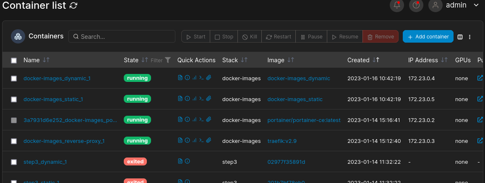

# STEP 6: Management UI

## Reference(s)

* [Find a solution, keyword: `docker container managing web`](https://search.brave.com/search?q=docker+container+managing+web)

* [Some solutions](https://karthi-net.medium.com/top-6-gui-tools-for-managing-docker-environments-ee2d69ba5a4f)

* [How to add portainer in a docker-compose.yml](https://jacar.es/en/como-instalar-portainer-con-docker-compose/)

## Implementation

With the last reference, we add the rules to launch a Portainer service to the [docker-compose.yml](docker-compose.yml).

## Usage

Starting by launching containers:

```shell
docker-compose up -d --build
```

Now, Portainer' service is accessible through a browser, by reaching [localhost:9000](http://localhost:9000) (port defined in compose rules).

First, it asks for a login:


Define your credentials.

This configuration will then be set in a `portainer-data/` folder. We haven't committed it in the repo. , for security reasons obviously.

So feel free to delete the [.gitignore](.gitignore) if you're copying the project and need to share datas throughout the repo. .

After login phase passed, it is possible to see which services are actually running.

Go to Home \> Dashboard, reach the local section that is displaying on the screen:


You'll reach a page listing infos, so reach the `Containers` to see various containers that the service detected on your machine.

Let's order them by creation date:




