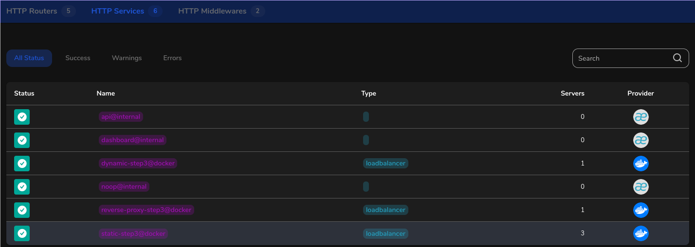
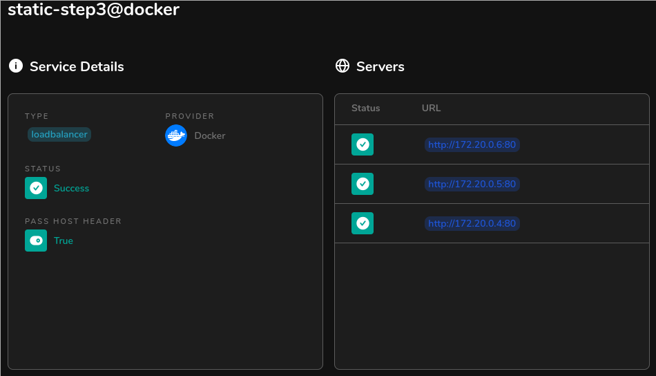

# Step3

## 1st part: docker compose

The main difference between docker run and docker compose is that:

- docker run: is entirely cmd based 
- docker compose: read a configuration file (in a YAML format)
    - Compose's rules can be made from created Dockerfile. This is great knowing that we write some for previous steps.

From tutorial in repo's [README](../../README.md) and some more web references, we can write the [docker-compose rules file](docker-compose.yml)

The rules are written to run 2 services (each service represents b
oth previous steps) and expose their ports to the host machine.

At first, it is needed to build the recipe, by doing:

```docker
docker-compose up
# OR
docker-compose up --build
```

The first cmd will print warning that the image has not been built already.

Then, it will run the container by default. It is possible to run
the container in background, with:

```docker
docker-compose start
```

The container can be killed with:

```docker
docker-compose stop
# OR
docker-compose kill 
```

## 2nd part: Launching pages

With a browser, it is now possible to access the static page by typing [localhost](http://localhost) in the nav. bar.

And for the dynamic page, it can be accessed by typing [localhost/api](http://localhost/api).

## 3rd part: Multiple instances

To launch multiple instances of a service, it can be done with the cmd:

```docker
docker-compose up --scale <SERVICE_NAME>=<N_INSTANCES>
```

Ex. we wrote a service ```static``` in [docker-compose.yml](docker-compose.yml):

```docker
# Launch 3 instances of the static service (see step1)
docker-compose up -d --scale static=3
```

To check the ips of the different instances, we need to reach the Traefik dashboard at [localhost:9000](http://localhost:9000) (9000 because we remap port 8080 on 9000 in the [docker-compose rules](docker-compose.yml) file.

Then reach: HTTP > Services, we have then a dashboard like:



On last row, we can see that the static-step3@docker has 3 servers launched. By clicking on it, we can see their ips to reach them:



